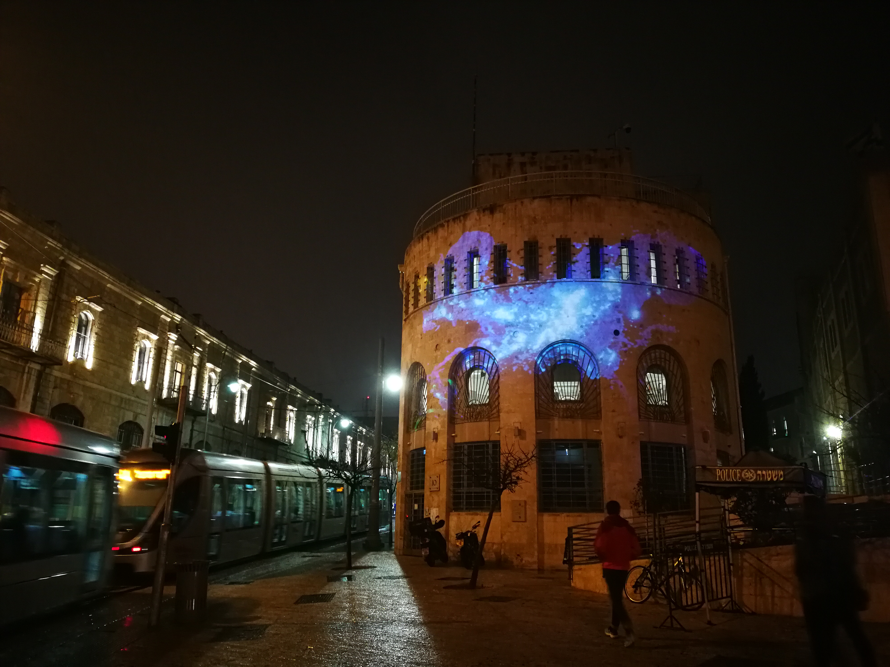
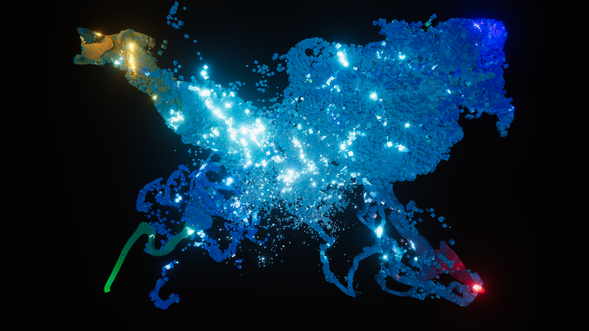

# Unity-Visual-Effects-Graph

I created a data sculpture while I was visiting Jerusalem to take part in an artist residency at HaMiffal هميفعل המפעל. "Demographics of Israel: Data Sculpture" visualises Israeli population based on its four main religious groups (Jewish, Muslim, Christian, and Druze) over the past seven decades.

There are four particle systems in the scene. Each particle system spawns particles within a volume of sphere, whose radius is set based on the percentage of the total population each year. Everything else is not based on any data.
So it's not like an accurate data visualization. I just used the data to create a piece.
